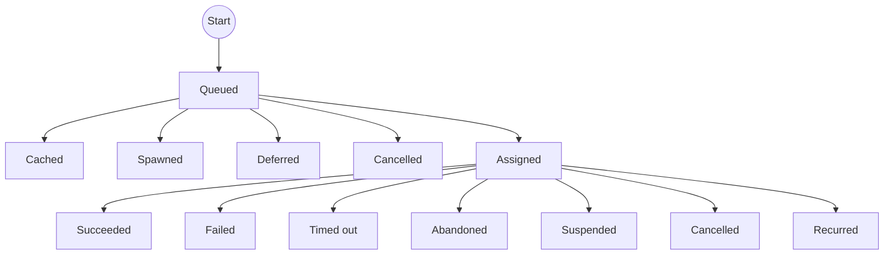

# Execution states

The state transitions of an execution can be represented in a diagram:

When an execution is first scheduled, it starts in the _Queued_ state — unless caching is enabled and there is a cache hit, in which case it transitions straight to _Cached_.

From the _Queued_ state it will transition to _Assigned_ once it is due and a suitable worker is available to run it, unless: caching is enabled and there's a cache hit; it refers to a workflow, in which case that is 'spawned' as a separate run; or it becomes 'deferred' to another execution in the meantime.

Once assigned, the worker will generally execute it until it succeeds (_Succeeded_) or raises an exception (_Failed_). If contact is lost with a worker for more than the timeout period, the tasks that are running will be marked as _Abandoned_ (we don't know whether they completed successfully). Executions may be _Cancelled_ while they're running (or before they've been assigned). An execution may choose to suspend itself (either explicitly, or from timing out while waiting for another execution to complete) — in this case it will be automatically re-run.

If a task has a [timeout](./timeouts.md) configured and exceeds it, the execution transitions to _Timed out_. The process is killed, child executions are cancelled, and any execution waiting on the result receives an `ExecutionTimeout` exception.

A [recurrent](./recurring.md) target that returns `None` transitions to _Recurred_, triggering the next recurrence.

Steps may be configured to automatically retry (from a failed, abandoned, or timed out state), or they may be re-run manually, in which case a new execution will be started.
