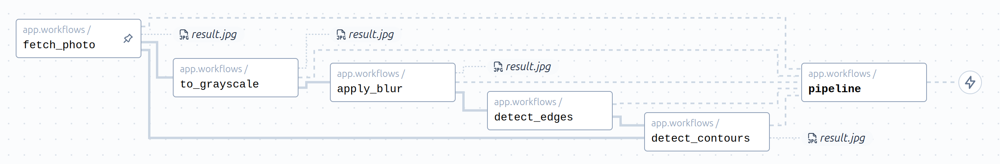
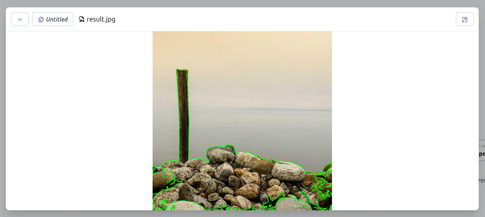

# Examples → Edge detection

This example shows a basic image processing pipeline. A random image is downloaded from an API, edge detection is performed, and then edges are rendered over the original image.



This makes use of assets, which can then be previewed in the web UI:

<p align="center">
  
</p>

## Running

Build Docker image:

```bash
docker build \
    --build-context coflux=coflux \
    --tag coflux_edgedetection \
    .
```

Run worker:

```bash
docker run --rm -t \
  --add-host host.docker.internal:host-gateway \
  -e COFLUX_HOST=host.docker.internal:7777 \
  -e COFLUX_PROJECT=... \
  -e COFLUX_SPACE=... \
  coflux_edgedetection
```

Or in development mode (allowing you to update the code without rebuilding/restarting):

```bash
docker run ... -v "$(pwd):/app" coflux_edgedetection worker --dev app.workflows
```
