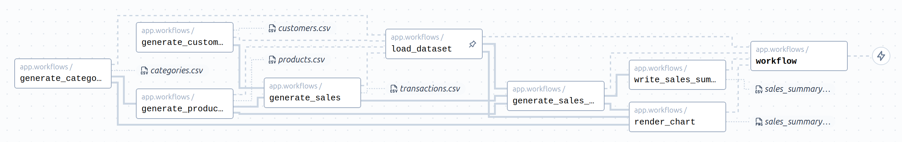
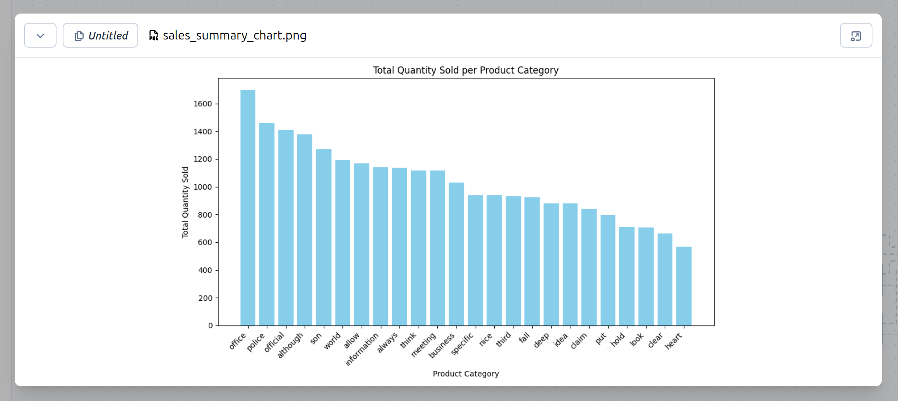

# Examples → Pandas/ETL

This example runs a basic ETL-like pipeline. A random dataset of customers/products/transactions is generated, this is then loaded into pandas, aggregated, and written to CSV.



This also renders a chart from the summary, which can be viewed in the web UI:

<p align="center">
  
</p>

# Running

Requires `uv`.

Install dependencies:

```bash
uv sync
```

Configure Coflux:

```bash
uv run configure --project=... --space=...
```

Run worker in development mode:

```bash
uv run coflux worker --dev app.workflows
```
