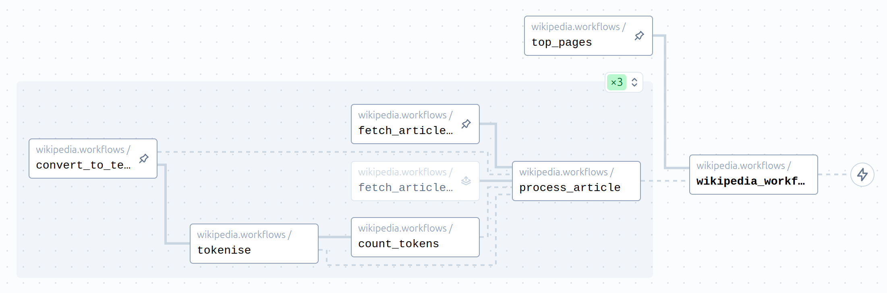

# Examples → Wikipedia

This example makes calls to the Wikipedia API to get the most viewed articles for the specified day and does some basic text operations on the pages (extracting text from HTML, tokenising, and counting tokens).



It makes use of caching/memoising, and shows how dependencies (e.g., the nltk model) can be bundled in a Docker file to simplify deployment.

# Running

Requires `uv`.

Install dependencies:

```bash
uv sync
```

Configure Coflux:

```bash
uv run configure --project=... --space=...
```

Run worker in development mode:

```bash
uv run coflux worker --dev wikipedia.workflows
```
